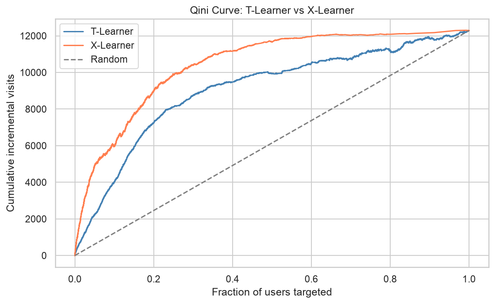
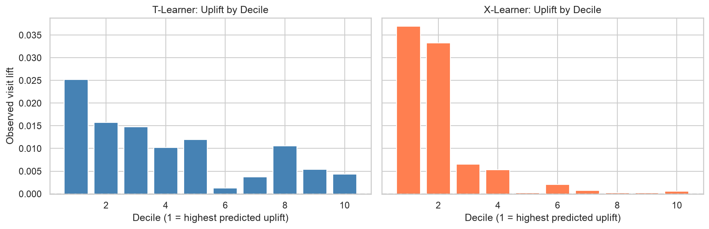
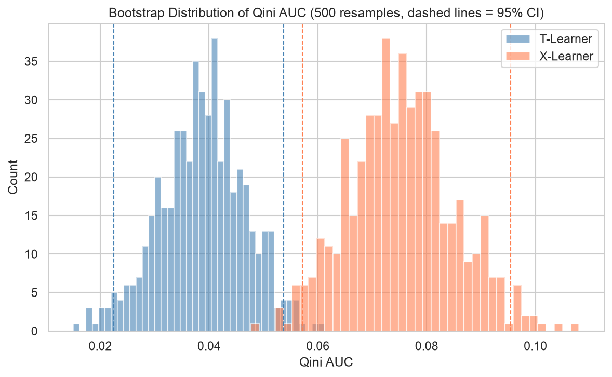
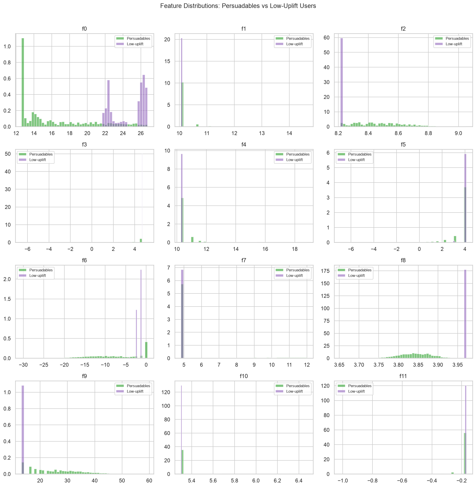
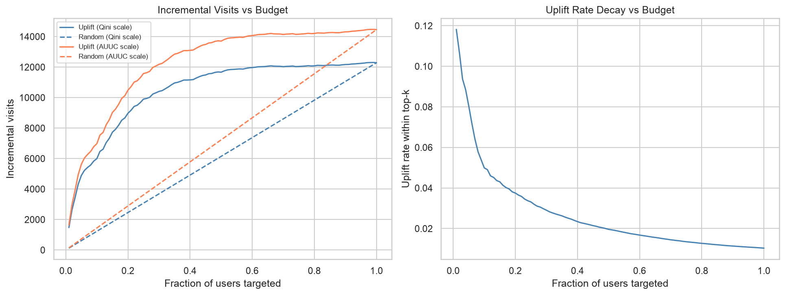
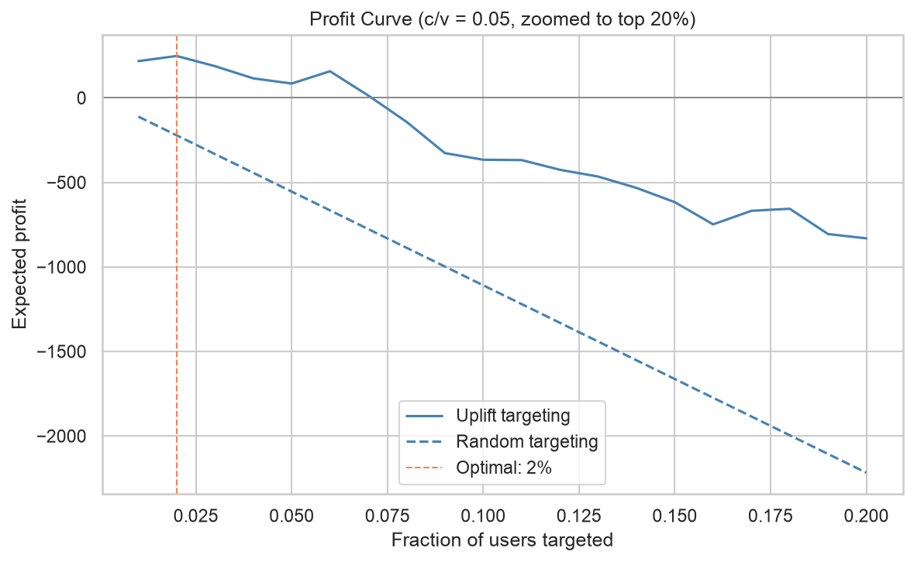
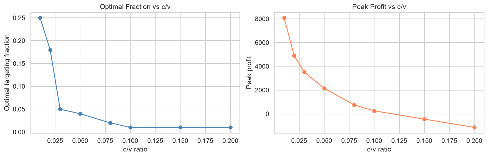
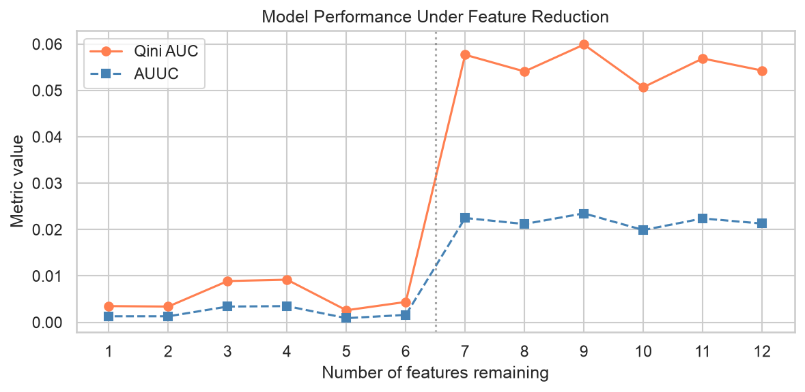
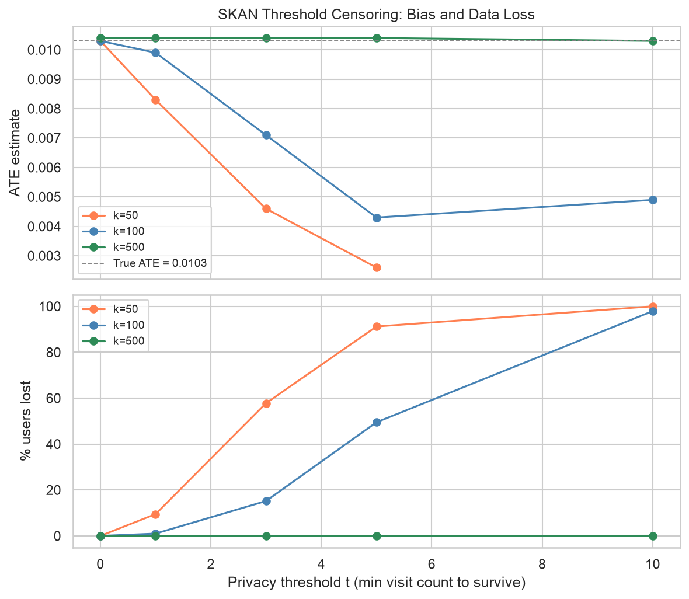

# Incremental Ad Targeting with Causal Machine Learning

Estimating individual-level incremental treatment effects for ad targeting using causal ML meta-learners.

## Motivation

Standard ad targeting optimizes for predicted conversion probability. The problem: the highest-converting users are often **sure things** who would have bought regardless of seeing an ad. Targeting them wastes budget without generating incremental lift.

Uplift modeling reframes the question from "who will convert?" to "who will convert *because* of the ad?" Under Apple's ATT framework, user-level cross-app attribution is largely unavailable, making incrementality the primary signal across the iOS advertising ecosystem.

## Dataset

[Criteo Uplift Modeling Dataset](https://ailab.criteo.com/criteo-uplift-prediction-dataset/): ~14M rows, 12 anonymized features, binary treatment/visit/conversion labels.

- Target: `visit` (visit rate ~4.7%, more signal than conversion at 0.29%)
- Treatment ratio: 85% treated / 15% control
- This project uses a 50% stratified sample (~7M rows); 80/20 train/test split gives ~5.6M train, 1.4M test

The paper releases two datasets: **CRITEO-UPLIFTv2** (real RCT data, used here) and **CRITEO-ITE** (semi-synthetic with generated response surfaces, used for PEHE benchmarking). This project uses CRITEO-UPLIFTv2.

The pipeline was first prototyped on a 10% sample (~1.4M rows) to validate the full workflow end-to-end before committing to the longer training runs. All results reported here reflect the 50% run.

## Methods

| Method | Description |
|--------|-------------|
| T-Learner | Train separate models on treatment and control groups, subtract predicted probabilities |
| X-Learner | Extension of T-Learner that handles treatment/control imbalance better via pseudo-treatment effects |

## Project Structure

```
uplift-modeling/
├── notebooks/
│   ├── 01_eda.ipynb
│   ├── 02_tlearner.ipynb
│   ├── 03_xlearner.ipynb
│   ├── 04_evaluation.ipynb
│   ├── 05_robustness_insight.ipynb
│   ├── 06_business_impact.ipynb
│   └── 07_privacy_constraints.ipynb
├── images/
├── models/
└── notes/
    ├── concepts.md
    └── methodology.md
```

## Results

**EDA (notebook 1)**
- Observed ATE by treatment assignment: 0.0103 (intention-to-treat)
- Observed difference by exposure (exposed vs control): 0.3763 — NOT a causal estimate. Exposure is non-random (winning the RTB auction correlates with user intent), so this is inflated by selection bias. The valid causal estimate is the ITT ATE (0.0103); the exposure figure illustrates why exposure cannot serve as the treatment variable.

**T-Learner (notebook 2)**
- Trained on ~5.6M rows (treatment: ~4.75M, control: ~838K); 80/20 train/test split
- Two separate LGBMClassifier models; uplift score = P(visit | T=1) − P(visit | T=0)

**X-Learner (notebook 3)**
- Implemented via `causalml` `BaseXClassifier` with LGBMClassifier (outcome) and LGBMRegressor (effect)
- Propensity passed as constant ~0.85 (RCT assumption, T ⊥ X)

**Evaluation (notebook 4)**

| Metric | T-Learner | X-Learner |
|---|---|---|
| Qini AUC | 0.0581 | 0.0853 |
| AUUC | 0.0228 | 0.0335 |
| Incremental visits at top 20% | 7,248 | 8,968 (+24%) |
| Decile 1 observed lift | — | 0.0499 |

X-Learner's Qini AUC is 47% higher than T-Learner's. At 10% scale the gap was 2x; it narrows at 50% scale because T-Learner's bottleneck (the small control arm) is directly relieved by more data — T-Learner improved 53% in Qini going from 10% to 50% scale vs X-Learner's 12%.





**Robustness & Insight (notebook 5)**

| Metric | Model | 95% CI |
|---|---|---|
| Qini AUC | T-Learner | [0.0516, 0.0656] |
| Qini AUC | X-Learner | [0.0776, 0.0943] |
| AUUC | T-Learner | [0.0202, 0.0257] |
| AUUC | X-Learner | [0.0306, 0.0370] |

Stratified bootstrap (500 resamples, treatment/control resampled separately to preserve the 85/15 split). The 95% CIs do not overlap for either metric, confirming the X-Learner advantage is robust and not sampling noise. Persuadables profiling (top 10% vs bottom 10% by predicted uplift, 139,796 users each) shows near-perfect feature separation on f8 and f2 (KS ≈ 0.9999), with persuadables scoring higher on f2 and f9 and lower on f0, f6, and f8.





**Business Impact (notebook 6)**

Budget efficiency at small targeting fractions (Qini scale, X-Learner vs random):

| Budget | Uplift targeting | Random | Ratio |
|---|---|---|---|
| 1% of users | 1,474 incr. visits | 123 | 12x |
| 10% of users | 5,994 incr. visits | 1,229 | 4.9x |

Budget savings to reach the same incremental visit threshold:

| Threshold | Uplift budget | Random budget | Saving |
|---|---|---|---|
| 50% of ceiling | 11% | 50% | 39pp |
| 80% of ceiling | 25% | 80% | 55pp |
| 95% of ceiling | 49% | 95% | 46pp |

Profit-aware targeting at c/v = 0.05: optimal policy targets the top 4% of users (55,918 users), capturing 4,946 incremental visits at a peak profit of 2,150 normalized units (e.g. v = $50 → ~$107,500). Optimal fraction expands to 25% at c/v = 0.01 and turns negative for all users at c/v ≥ 0.15.







**Privacy Constraints (notebook 7)**

Three mechanisms degrade incrementality measurement differently:

| Mechanism | Effect on measurement | Verdict |
|---|---|---|
| Feature loss | KS-based importance mislabels model *reliance* as *value*; effect is regime-dependent | ranking degrades under constrained data |
| Threshold censoring | MNAR — low-conversion cohorts dropped, biasing ATE downward | aggregate estimate biased |
| Sample shrinkage | CI widens as opt-in falls; unbiased above a sample-size floor | survives above N_min |

*Feature loss.* f8 and f2 rank highest by KS-based importance yet are weak uplift features (solo Qini 0.036 vs 0.085 full model) — strong outcome predictors are not good uplift features (ROC AUC 0.94 on visit vs near-random uplift ranking). Removing them costs only ~2.2% Qini at full scale, and the apparent gains at smaller scale fall within the noise band. KS measures model reliance, not uplift value.

*Threshold censoring.* Dropping low-conversion cohorts is Missing Not At Random: the control arm (lower base rate) loses more cohorts, compressing the ATE downward. At k=50/t=5 the true 0.0103 effect measures as 0.0026 (75% bias, 91% data loss); larger cohorts (k=500) stay robust. Aggregation adds noise; censoring adds bias.

*Statistical power.* Detecting the 0.0103 effect needs N_min ≈ 26,000 users — roughly 2x a balanced experiment, since the 85/15 allocation imposes a 1.4x MDE penalty that squares into sample size. A bootstrap sweep and the analytic N_min independently bracket the same detection boundary (~1.9% opt-in); the aggregate ATE stays unbiased but becomes undetectable below it.

While these experiments simulate Apple's ATT/SKAN specifically, the degradation patterns are properties of the aggregation-plus-threshold design itself — Google's Privacy Sandbox and GDPR-driven consent regimes follow the same paradigm.





## Tech Stack

Python · LightGBM · scikit-uplift · causalml

## Project Phases

- [x] Phase 1: EDA (`01_eda.ipynb`)
- [x] Phase 2: T-Learner (`02_tlearner.ipynb`)
- [x] Phase 3: X-Learner (`03_xlearner.ipynb`)
- [x] Phase 4: Evaluation (`04_evaluation.ipynb`)
- [x] Phase 5: Robustness & Insight (`05_robustness_insight.ipynb`)
- [x] Phase 6: Business Impact (`06_business_impact.ipynb`)
- [x] Phase 7: Privacy Constraints (`07_privacy_constraints.ipynb`)
- [x] Phase 8: README & Documentation

## References

- Diemert et al. (2018). [A Large Scale Benchmark for Uplift Modeling](https://arxiv.org/pdf/2111.10106)
- [scikit-uplift docs](https://www.uplift-modeling.com/en/latest/)
- [Uber CausalML](https://github.com/uber/causalml)
- [Criteo Uplift Dataset on Hugging Face](https://huggingface.co/datasets/criteo/criteo-uplift)

## Citation

```bibtex
@inproceedings{Diemert2018,
  author = {{Diemert Eustache, Betlei Artem} and Renaudin, Christophe and Massih-Reza, Amini},
  title={A Large Scale Benchmark for Uplift Modeling},
  publisher = {ACM},
  booktitle = {Proceedings of the AdKDD and TargetAd Workshop, KDD, London, United Kingdom, August, 20, 2018},
  year = {2018}
}
```
